# iNat vision model: example saliency maps

This page lists **multiple example photos** (different subjects and scenes) run through the [`inat_vision_saliency`](../inat_vision_saliency/) package (see [`../INTEGRATION.md`](../INTEGRATION.md)). For each image we show the model input (299×299 resize), the **gradient saliency** overlay for the **top-1 softmax class**, and the scientific name for that class. Class indices match the `leaf_class_id` column in the release [`taxonomy.csv`](https://github.com/inaturalist/model-files/releases/download/v25.01.15/taxonomy.csv) (same mapping as the mobile `Taxonomy` loader in [vision-camera-plugin-inatvision](https://github.com/inaturalist/vision-camera-plugin-inatvision)).

> **On GitHub:** from the repo home page, navigate to `tools/inat_vision_saliency/examples/EXAMPLES.md` on your branch (GitHub renders Markdown and in-repo images).

## Examples

### 1. `bear`

**Photo:** [PlaceBear](https://placebear.com)  

**Top-1 prediction:** *Procyon lotor* — iNat taxon `41663` — model leaf index `437` — p = `0.1187`

| Input (resized in tool) | Saliency overlay |
|---------------------------|------------------|
|  |  |

### 2. `picsum_28`

**Photo:** [Lorem Picsum](https://picsum.photos) id 28  

**Top-1 prediction:** *Pseudotsuga menziesii* — iNat taxon `48256` — model leaf index `440` — p = `0.0949`

| Input (resized in tool) | Saliency overlay |
|---------------------------|------------------|
| 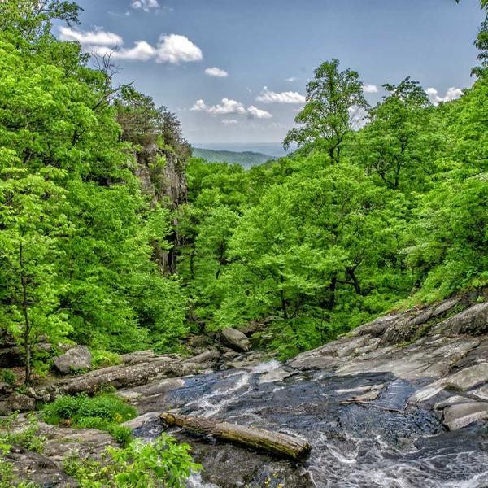 | 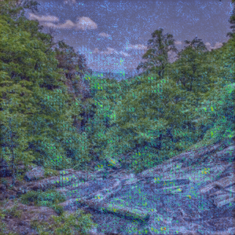 |

### 3. `picsum_40`

**Photo:** [Lorem Picsum](https://picsum.photos) id 40  

**Top-1 prediction:** *Oncopeltus fasciatus* — iNat taxon `55556` — model leaf index `455` — p = `0.0457`

| Input (resized in tool) | Saliency overlay |
|---------------------------|------------------|
| 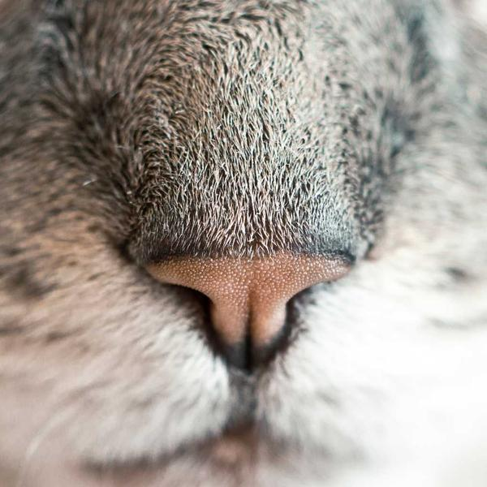 | 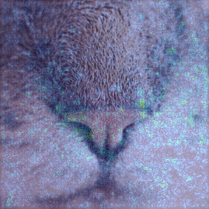 |

### 4. `picsum_52`

**Photo:** [Lorem Picsum](https://picsum.photos) id 52  

**Top-1 prediction:** *Harmonia axyridis* — iNat taxon `48484` — model leaf index `232` — p = `0.1242`

| Input (resized in tool) | Saliency overlay |
|---------------------------|------------------|
|  | 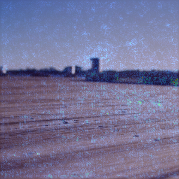 |

### 5. `picsum_65`

**Photo:** [Lorem Picsum](https://picsum.photos) id 65  

**Top-1 prediction:** *Verbascum thapsus* — iNat taxon `59029` — model leaf index `225` — p = `0.0766`

| Input (resized in tool) | Saliency overlay |
|---------------------------|------------------|
|  |  |

### 6. `picsum_76`

**Photo:** [Lorem Picsum](https://picsum.photos) id 76  

**Top-1 prediction:** *Setophaga coronata* — iNat taxon `145245` — model leaf index `302` — p = `0.0405`

| Input (resized in tool) | Saliency overlay |
|---------------------------|------------------|
|  |  |

### 7. `picsum_101`

**Photo:** [Lorem Picsum](https://picsum.photos) id 101  

**Top-1 prediction:** *Populus tremuloides* — iNat taxon `54840` — model leaf index `358` — p = `0.0723`

| Input (resized in tool) | Saliency overlay |
|---------------------------|------------------|
|  | 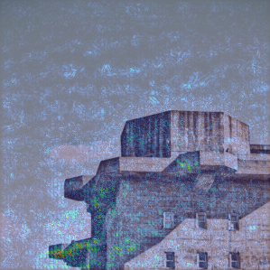 |

### 8. `picsum_119`

**Photo:** [Lorem Picsum](https://picsum.photos) id 119  

**Top-1 prediction:** *Caltha palustris* — iNat taxon `56224` — model leaf index `378` — p = `0.0971`

| Input (resized in tool) | Saliency overlay |
|---------------------------|------------------|
|  |  |

### 9. `picsum_160`

**Photo:** [Lorem Picsum](https://picsum.photos) id 160  

**Top-1 prediction:** *Glechoma hederacea* — iNat taxon `55830` — model leaf index `41` — p = `0.0482`

| Input (resized in tool) | Saliency overlay |
|---------------------------|------------------|
|  |  |

### 10. `picsum_237`

**Photo:** [Lorem Picsum](https://picsum.photos) id 237  

**Top-1 prediction:** *Picea abies* — iNat taxon `63567` — model leaf index `370` — p = `0.2942`

| Input (resized in tool) | Saliency overlay |
|---------------------------|------------------|
|  | 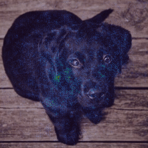 |

### 11. `picsum_338`

**Photo:** [Lorem Picsum](https://picsum.photos) id 338  

**Top-1 prediction:** *Mytilus californianus* — iNat taxon `62806` — model leaf index `93` — p = `0.1409`

| Input (resized in tool) | Saliency overlay |
|---------------------------|------------------|
|  |  |

### 12. `picsum_433`

**Photo:** [Lorem Picsum](https://picsum.photos) id 433  

**Top-1 prediction:** *Cathartes aura* — iNat taxon `4756` — model leaf index `66` — p = `0.0569`

| Input (resized in tool) | Saliency overlay |
|---------------------------|------------------|
|  |  |

### 13. `picsum_582`

**Photo:** [Lorem Picsum](https://picsum.photos) id 582  

**Top-1 prediction:** *Canis latrans* — iNat taxon `42051` — model leaf index `467` — p = `0.8613`

| Input (resized in tool) | Saliency overlay |
|---------------------------|------------------|
| 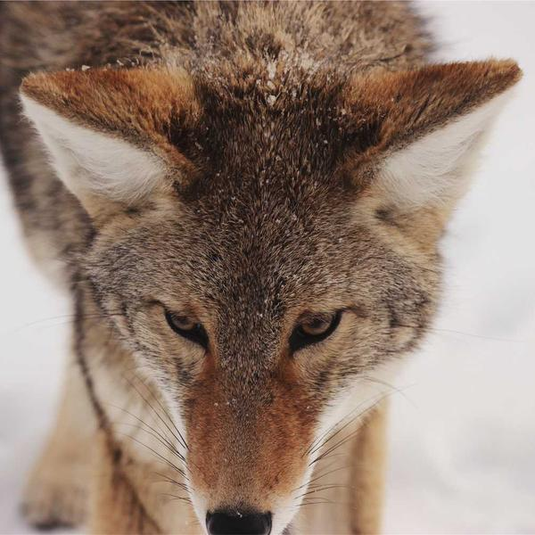 | 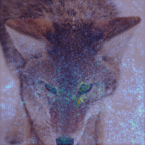 |

### 14. `picsum_659`

**Photo:** [Lorem Picsum](https://picsum.photos) id 659  

**Top-1 prediction:** *Canis latrans* — iNat taxon `42051` — model leaf index `467` — p = `0.1288`

| Input (resized in tool) | Saliency overlay |
|---------------------------|------------------|
| 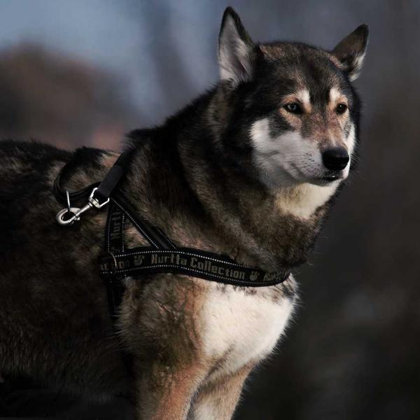 | 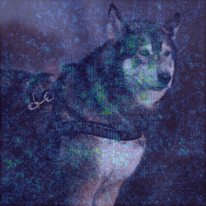 |

### 15. `picsum_718`

**Photo:** [Lorem Picsum](https://picsum.photos) id 718  

**Top-1 prediction:** *Canis latrans* — iNat taxon `42051` — model leaf index `467` — p = `0.9211`

| Input (resized in tool) | Saliency overlay |
|---------------------------|------------------|
| 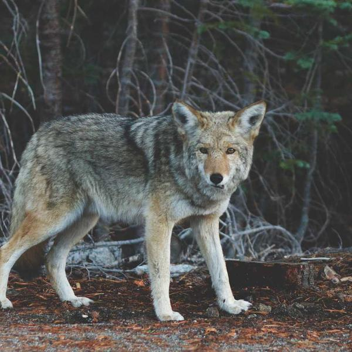 | 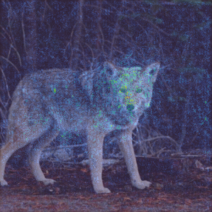 |

### 16. `picsum_824`

**Photo:** [Lorem Picsum](https://picsum.photos) id 824  

**Top-1 prediction:** *Pinus sylvestris* — iNat taxon `58722` — model leaf index `43` — p = `0.3255`

| Input (resized in tool) | Saliency overlay |
|---------------------------|------------------|
| 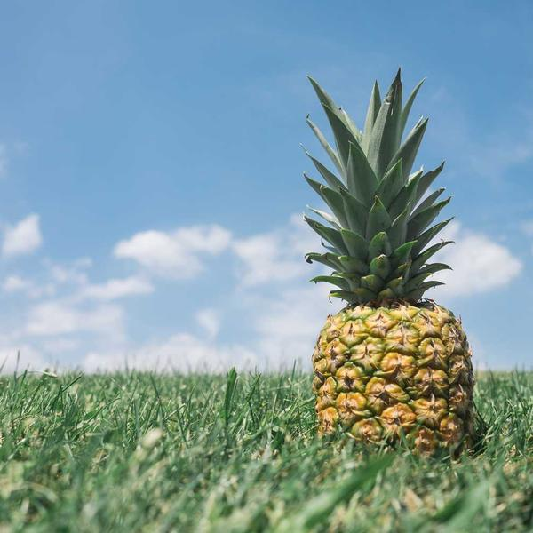 | 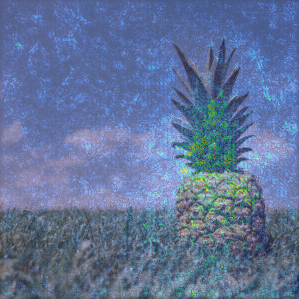 |

### 17. `picsum_957`

**Photo:** [Lorem Picsum](https://picsum.photos) id 957  

**Top-1 prediction:** *Pinus sylvestris* — iNat taxon `58722` — model leaf index `43` — p = `0.0841`

| Input (resized in tool) | Saliency overlay |
|---------------------------|------------------|
|  | 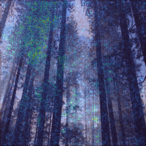 |

### 18. `picsum_1025`

**Photo:** [Lorem Picsum](https://picsum.photos) id 1025  

**Top-1 prediction:** *Sympetrum vicinum* — iNat taxon `68139` — model leaf index `316` — p = `0.0396`

| Input (resized in tool) | Saliency overlay |
|---------------------------|------------------|
|  |  |

### 19. `picsum_219`

**Photo:** [Lorem Picsum](https://picsum.photos) id 219  

**Top-1 prediction:** *Argynnis paphia* — iNat taxon `123628` — model leaf index `142` — p = `0.0885`

| Input (resized in tool) | Saliency overlay |
|---------------------------|------------------|
| 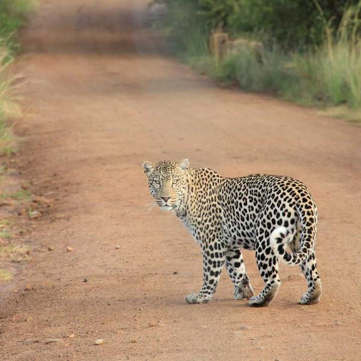 | 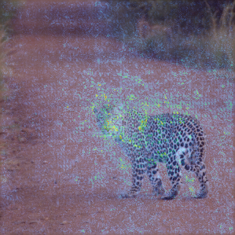 |

### 20. `picsum_292`

**Photo:** [Lorem Picsum](https://picsum.photos) id 292  

**Top-1 prediction:** *Platanus occidentalis* — iNat taxon `49662` — model leaf index `106` — p = `0.1179`

| Input (resized in tool) | Saliency overlay |
|---------------------------|------------------|
|  |  |

## Earlier samples

Smaller JPEGs committed before this gallery (`sample_a.jpg`, `sample_b.jpg`, `sample_c.jpg`) and their overlays remain in [`inputs/`](inputs/) and [`outputs/`](outputs/).

## Regenerating this file

From the repository root, with the vision `.tflite` cached under `tools/inat_vision_saliency/.cache/` and Python deps installed (`pip install -e tools/inat_vision_saliency`):

```bash
python3 tools/inat_vision_saliency/examples/generate_gallery.py
```

Alternatively, saliency for a single image:

```bash
npm run vision-saliency -- path/to/photo.jpg --tflite tools/inat_vision_saliency/.cache/INatVision_Small_2_fact256_8bit.tflite -o out.png
```
