# iNat vision model: example saliency maps (wild animals)

> **On GitHub:** from the repo home page, open `tools/inat_vision_saliency/examples/EXAMPLES.md` on your branch.

This gallery uses **only wild-animal-oriented examples**: PlaceBear (bears) plus fixed [Lorem Picsum](https://picsum.photos) photo IDs that were screened so the model’s **top-1** prediction is an **animal** species (insects, birds, mammals, etc.), not plants or scenery-only taxa. Each row shows the 299×299 input, a turbo saliency blend for the predicted class, and the **smallest square** bounding high-saliency pixels (lime outline) computed in [`saliency_map.py`](../inat_vision_saliency/saliency_map.py). See also [`../INTEGRATION.md`](../INTEGRATION.md). For **two fixed-class** true-gradient maps (single-color overlays), see [`DUAL_SALIENCY_EXAMPLE.md`](DUAL_SALIENCY_EXAMPLE.md).

Class indices match the `leaf_class_id` column in the release [`taxonomy.csv`](https://github.com/inaturalist/model-files/releases/download/v25.01.15/taxonomy.csv) (same mapping as the mobile `Taxonomy` loader in [vision-camera-plugin-inatvision](https://github.com/inaturalist/vision-camera-plugin-inatvision)).

## Examples

### 1. `bear`

**Photo:** [PlaceBear](https://placebear.com) (wild bears)  

**Top-1 prediction:** *Procyon lotor* — iNat taxon `41663` — model leaf index `437` — p = `0.1187`

**Salient square (inclusive x0,y0,x1,y1):** `25, 3, 286, 264`  

| Input (resized in tool) | Saliency + salient square |
|---------------------------|-----------------------------|
| 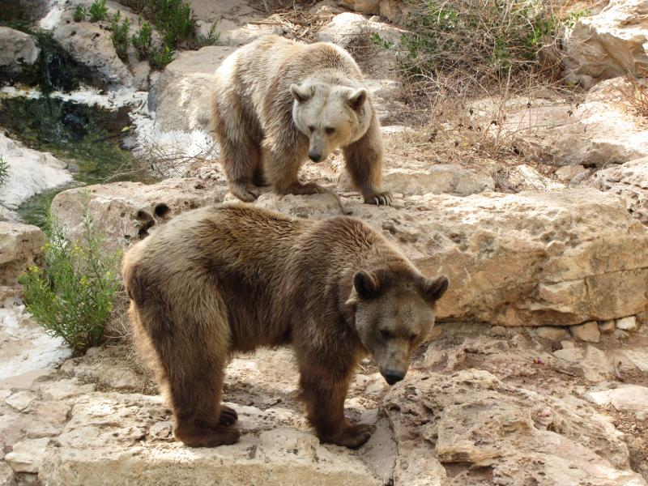 | 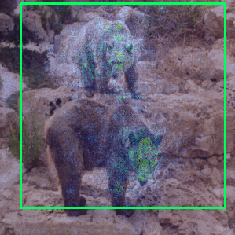 |

### 2. `picsum_1`

**Photo:** [Lorem Picsum](https://picsum.photos) id 1 (wildlife-oriented pick; top-1 is an animal species)  

**Top-1 prediction:** *Pentatoma rufipes* — iNat taxon `51275` — model leaf index `392` — p = `0.1572`

**Salient square (inclusive x0,y0,x1,y1):** `1, 1, 297, 297`  

| Input (resized in tool) | Saliency + salient square |
|---------------------------|-----------------------------|
|  |  |

### 3. `picsum_2`

**Photo:** [Lorem Picsum](https://picsum.photos) id 2 (wildlife-oriented pick; top-1 is an animal species)  

**Top-1 prediction:** *Stagmomantis carolina* — iNat taxon `119989` — model leaf index `490` — p = `0.0690`

**Salient square (inclusive x0,y0,x1,y1):** `2, 2, 296, 296`  

| Input (resized in tool) | Saliency + salient square |
|---------------------------|-----------------------------|
|  |  |

### 4. `picsum_3`

**Photo:** [Lorem Picsum](https://picsum.photos) id 3 (wildlife-oriented pick; top-1 is an animal species)  

**Top-1 prediction:** *Pentatoma rufipes* — iNat taxon `51275` — model leaf index `392` — p = `0.1171`

**Salient square (inclusive x0,y0,x1,y1):** `16, 10, 298, 292`  

| Input (resized in tool) | Saliency + salient square |
|---------------------------|-----------------------------|
|  |  |

### 5. `picsum_5`

**Photo:** [Lorem Picsum](https://picsum.photos) id 5 (wildlife-oriented pick; top-1 is an animal species)  

**Top-1 prediction:** *Clogmia albipunctata* — iNat taxon `258813` — model leaf index `309` — p = `0.1084`

**Salient square (inclusive x0,y0,x1,y1):** `54, 126, 156, 228`  

| Input (resized in tool) | Saliency + salient square |
|---------------------------|-----------------------------|
|  | 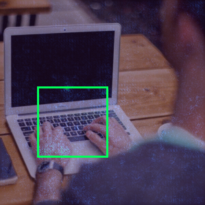 |

### 6. `picsum_6`

**Photo:** [Lorem Picsum](https://picsum.photos) id 6 (wildlife-oriented pick; top-1 is an animal species)  

**Top-1 prediction:** *Pentatoma rufipes* — iNat taxon `51275` — model leaf index `392` — p = `0.0634`

**Salient square (inclusive x0,y0,x1,y1):** `1, 1, 296, 296`  

| Input (resized in tool) | Saliency + salient square |
|---------------------------|-----------------------------|
|  |  |

### 7. `picsum_8`

**Photo:** [Lorem Picsum](https://picsum.photos) id 8 (wildlife-oriented pick; top-1 is an animal species)  

**Top-1 prediction:** *Clogmia albipunctata* — iNat taxon `258813` — model leaf index `309` — p = `0.0647`

**Salient square (inclusive x0,y0,x1,y1):** `3, 2, 296, 295`  

| Input (resized in tool) | Saliency + salient square |
|---------------------------|-----------------------------|
|  |  |

### 8. `picsum_9`

**Photo:** [Lorem Picsum](https://picsum.photos) id 9 (wildlife-oriented pick; top-1 is an animal species)  

**Top-1 prediction:** *Pentatoma rufipes* — iNat taxon `51275` — model leaf index `392` — p = `0.0924`

**Salient square (inclusive x0,y0,x1,y1):** `2, 1, 296, 295`  

| Input (resized in tool) | Saliency + salient square |
|---------------------------|-----------------------------|
|  | 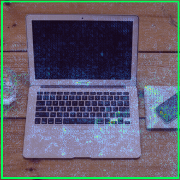 |

### 9. `picsum_11`

**Photo:** [Lorem Picsum](https://picsum.photos) id 11 (wildlife-oriented pick; top-1 is an animal species)  

**Top-1 prediction:** *Odocoileus hemionus* — iNat taxon `42220` — model leaf index `182` — p = `0.1621`

**Salient square (inclusive x0,y0,x1,y1):** `12, 20, 290, 298`  

| Input (resized in tool) | Saliency + salient square |
|---------------------------|-----------------------------|
| 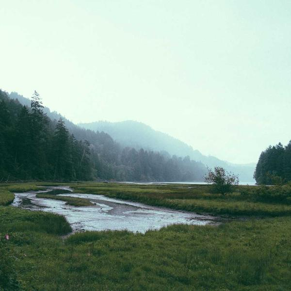 | 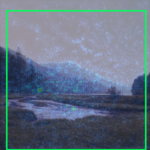 |

### 10. `picsum_14`

**Photo:** [Lorem Picsum](https://picsum.photos) id 14 (wildlife-oriented pick; top-1 is an animal species)  

**Top-1 prediction:** *Ardea herodias* — iNat taxon `4956` — model leaf index `20` — p = `0.1430`

**Salient square (inclusive x0,y0,x1,y1):** `3, 4, 296, 297`  

| Input (resized in tool) | Saliency + salient square |
|---------------------------|-----------------------------|
| 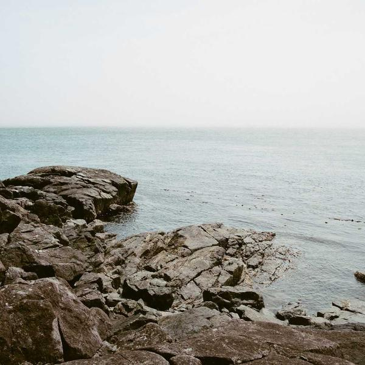 | 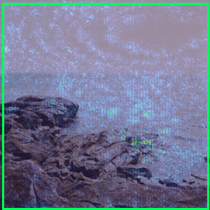 |

### 11. `picsum_17`

**Photo:** [Lorem Picsum](https://picsum.photos) id 17 (wildlife-oriented pick; top-1 is an animal species)  

**Top-1 prediction:** *Vulpes vulpes* — iNat taxon `42069` — model leaf index `435` — p = `0.0661`

**Salient square (inclusive x0,y0,x1,y1):** `3, 4, 296, 297`  

| Input (resized in tool) | Saliency + salient square |
|---------------------------|-----------------------------|
| 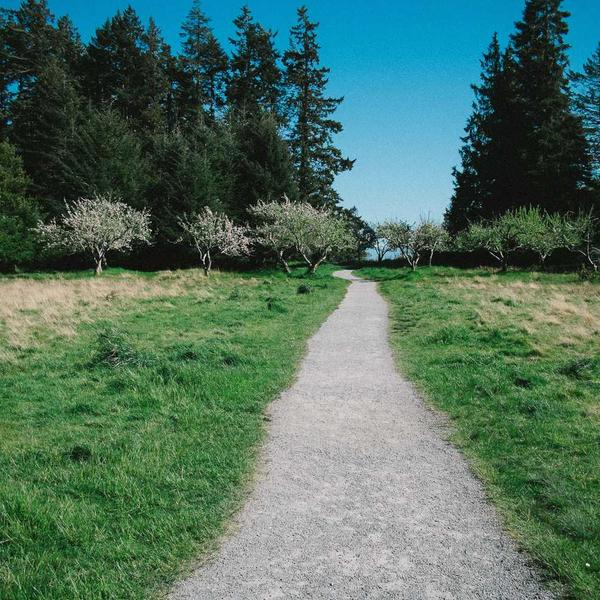 | 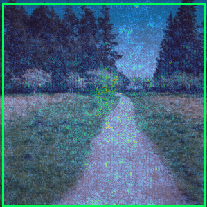 |

### 12. `picsum_20`

**Photo:** [Lorem Picsum](https://picsum.photos) id 20 (wildlife-oriented pick; top-1 is an animal species)  

**Top-1 prediction:** *Pieris brassicae* — iNat taxon `55401` — model leaf index `254` — p = `0.0372`

**Salient square (inclusive x0,y0,x1,y1):** `1, 1, 296, 296`  

| Input (resized in tool) | Saliency + salient square |
|---------------------------|-----------------------------|
|  |  |

### 13. `picsum_21`

**Photo:** [Lorem Picsum](https://picsum.photos) id 21 (wildlife-oriented pick; top-1 is an animal species)  

**Top-1 prediction:** *Limax maximus* — iNat taxon `62470` — model leaf index `78` — p = `0.0312`

**Salient square (inclusive x0,y0,x1,y1):** `1, 0, 294, 293`  

| Input (resized in tool) | Saliency + salient square |
|---------------------------|-----------------------------|
|  | 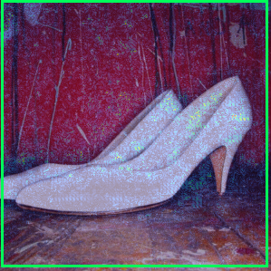 |

### 14. `picsum_23`

**Photo:** [Lorem Picsum](https://picsum.photos) id 23 (wildlife-oriented pick; top-1 is an animal species)  

**Top-1 prediction:** *Pieris napi* — iNat taxon `54087` — model leaf index `177` — p = `0.1535`

**Salient square (inclusive x0,y0,x1,y1):** `2, 2, 294, 294`  

| Input (resized in tool) | Saliency + salient square |
|---------------------------|-----------------------------|
|  | 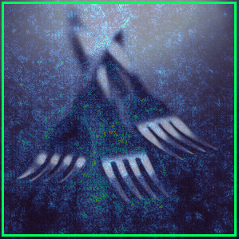 |

### 15. `picsum_24`

**Photo:** [Lorem Picsum](https://picsum.photos) id 24 (wildlife-oriented pick; top-1 is an animal species)  

**Top-1 prediction:** *Orgyia leucostigma* — iNat taxon `81665` — model leaf index `367` — p = `0.0654`

**Salient square (inclusive x0,y0,x1,y1):** `3, 12, 289, 298`  

| Input (resized in tool) | Saliency + salient square |
|---------------------------|-----------------------------|
|  | 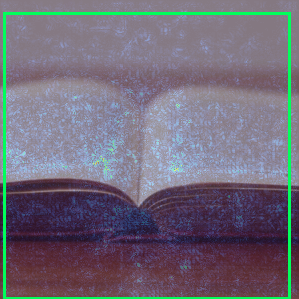 |

### 16. `picsum_25`

**Photo:** [Lorem Picsum](https://picsum.photos) id 25 (wildlife-oriented pick; top-1 is an animal species)  

**Top-1 prediction:** *Agelaius phoeniceus* — iNat taxon `9744` — model leaf index `25` — p = `0.1503`

**Salient square (inclusive x0,y0,x1,y1):** `3, 2, 297, 296`  

| Input (resized in tool) | Saliency + salient square |
|---------------------------|-----------------------------|
| 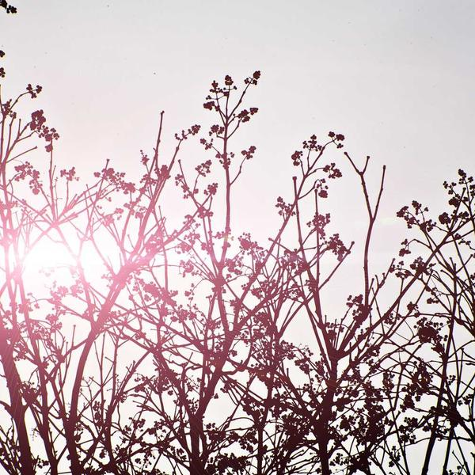 | 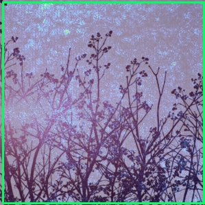 |

## Regenerating this file

From the repository root, with the vision `.tflite` cached under `tools/inat_vision_saliency/.cache/` and Python deps installed (`pip install -e tools/inat_vision_saliency`):

```bash
python3 tools/inat_vision_saliency/examples/generate_gallery.py
```

Alternatively, saliency for a single image: `npm run vision-saliency -- path/to/photo.jpg --tflite tools/inat_vision_saliency/.cache/INatVision_Small_2_fact256_8bit.tflite -o out.png`.
